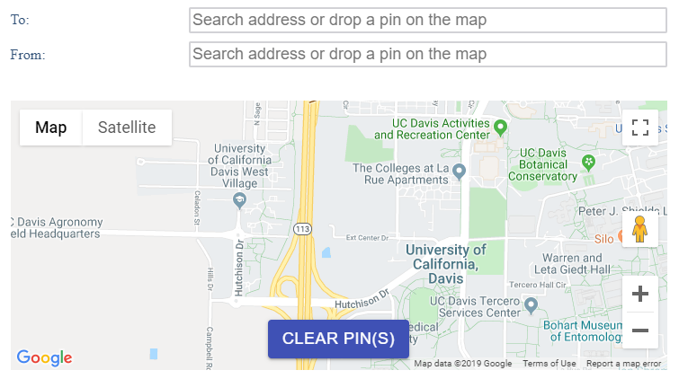

# qualtrics-map

A react-based component that displays an embedded Google Maps in [Qualtrics](https://www.qualtrics.com).

## Features

- Collection of multiple answers in one question.
  - e.g., "From:" and "To:"
- Use either of address bar with autocomplete or map marker.

---



---

# Installation

## Google Maps API

This library uses Google [Geocoding API](https://developers.google.com/maps/documentation/geocoding/overview), [Maps Javascript API](https://developers.google.com/maps/documentation/javascript/tutorial), and [Places API](https://developers.google.com/places/web-service/intro).  
Make sure you have a key to access those APIs.

## Option 1 (use CDN)

<details>
<summary>Click to open</summary>
  
Copy [https://cdn.jsdelivr.net/gh/keita-makino/qualtrics-map/dist/bundle.js](https://cdn.jsdelivr.net/gh/keita-makino/qualtrics-map/dist/bundle.js) <- this address (*not the contents of this address*) and proceed to "Header settings".

</details>

## Option 2 (manual upload)

<details>
<summary>Click to open</summary>
  
## Get bundle.txt

There are two ways to obtain your `bundle.txt`. Choose one way as your needs and then proceed to "Qualtrics Survey Settings".

### Using template

Download the template from the [relaese page](https://github.com/keita-makino/qualtrics-map/releases).

### Build by yourself

Alternatively, you can build the component in your environment.  
This approach is neeeded if you want to custom the component (placeholder text, button color, and others).

1. Clone or download the repository.
1. `npm ci`
1. `npm run build`

## Qualtrics Survey Settings

### File Upload

1. Go to the files library in Qualtrics.
1. Upload the text file.
1. Click the gear icon at the right of the uploaded file and select "Rename File".
1. Select the uploaded file and click "View" button.
1. Copy the URL of the file opened in the new window and proceed to "Header settings".

</details>

## Header settings

1. In the survey edit screen, click "Look & Feel" on right-top.
1. Select "General" tab and then edit the "Header".
1. Click the "<>" icon to enter coding-view.
1. Copy and paste the following code, replacing the `[apiKey]` and `[fileUrl]` with respectively the API key and the URL that you copied above.

```javascript
<script>
  var apiKeyGoogleMap = '[apiKey]';
  var countryCode = '${loc://CountryCode}';
  var postalCode = '${loc://PostalCode}';
</script><br />
<script src="[fileUrl]"></script>
```

## Use it

1. The question that you want add the map has to be set as "Text Entry" + "Form" question.
1. Add / remove text fields and set the field tag as you need. (e.g., Two text fields named "From:" and "To:").
1. In the question, click the gear icon and then "Add Javascript..."
1. Use the following code.
1. If you need to set a default center location, use the latter one.
1. **All done!**

```javascript
Qualtrics.SurveyEngine.addOnload(function () {
  document
    .getElementById(this.questionId)
    .querySelectorAll('[role*=presentation]')[0].style.display = 'none';
});

Qualtrics.SurveyEngine.addOnReady(function () {
  mapRender(apiKeyGoogleMap, document.getElementById(this.questionId));
});

// If you need to set a default center
Qualtrics.SurveyEngine.addOnReady(function () {
  mapRender(apiKeyGoogleMap, document.getElementById(this.questionId), {
    location: {
      lat: 50,
      lng: -100,
    },
    zoom: 12, // Optional
  });
});
```
